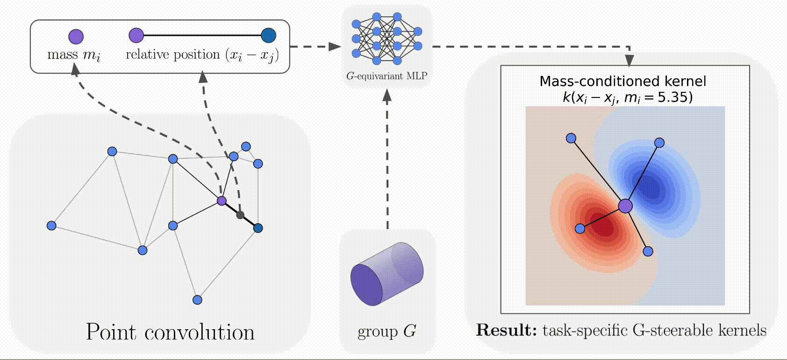

<div align="center">

<p align="center">
  <a href="https://arxiv.org/abs/2212.06096"></a>
</p>

<h3>Implicit Convolutional Kernels for Steerable CNNs (NeurIPS 2023) </h3>

<b> Authors: </b> Maksim Zhdanov, Nico Hoffmann, Gabriele Cesa

[ArXiv](https://arxiv.org/abs/2212.06096) | [Blog post](https://maxxxzdn.github.io/blog/implicit_kernels.html) | [Examples](/examples)


</div>

---

✨ How can we simplify designing equivariant neural networks and make them more expressive? By using implicit parameterization of convolutional kernels! ✨ 

- It is theoretically guaranteed that equivariance of the parameterization yields equivariance of the convolutional layer.

- It is possible now to condition convolutional kernels on arbitrary attributes, improving the expressiveness of the model.

- In this repository, we provide implementation for any subgroup of the Euclidean group $E(n)$.

- **New** 🚀: if you are interested in a more general case of $E(p,q)$, e.g. spacetime isometries, make sure to check this [repository](https://github.com/maxxxzdn/clifford-group-equivariant-cnns).

## Abstract

Steerable convolutional neural networks (CNNs) provide a general framework for building neural networks equivariant to translations and other transformations belonging to an origin-preserving group $G$, such as reflections and rotations. They rely on standard convolutions with $G$-steerable kernels obtained by analytically solving the group-specific equivariance constraint imposed onto the kernel space. As the solution is tailored to a particular group $G$, the implementation of a kernel basis does not generalize to other symmetry transformations, which complicates the development of general group equivariant models. We propose using implicit neural representation via multi-layer perceptrons (MLPs) to parameterize $G$-steerable kernels. The resulting framework offers a simple and flexible way to implement Steerable CNNs and generalizes to any group $G$ for which a $G$-equivariant MLP can be built. We prove the effectiveness of our method on multiple tasks, including N-body simulations, point cloud classification, and molecular property prediction.

## Requirements and Installation

- Python 3.8
- torch 1.10
- escnn 1.0.2
- pytorch-lightning 1.4.8
- torch-geometric 1.7.2

## Tutorials
Check `examples/` for following tutorials:
1. `kernels.ipynb` - how to initialize kernels + validating the corectness of learned bases.
2. `grid_conv.ipynb` - initializing SO(2) and O(2)-equivariant convolution with implicit kernels on **a regular grid** + validating its equivariance.
3. `point_conv.ipynb`- initializing SO(2) and O(2)-equivariant convolution with implicit kernels on **a point cloud** + validating its equivariance.
4. `model.ipynb` - creating a simple point cloud model that is O(3)-equivariant.

## Code Organization

- `datasets/`: Data loading modules for N-body, MN-10/40 and QM9 experiments.
- `models/`: Method implementation + a regression model for the QM9 experiment.
- `models/core`: Implementation of implicit kernels in escnn.
- `scripts/`: Training scripts for the experiments.
- `utils/`: Utility scripts.

## Citation
If you found this code useful, please cite our paper:
```
@inproceedings{
zhdanov2023implicit,
title={Implicit Convolutional Kernels for Steerable {CNN}s},
author={Zhdanov, Maksim and Hoffmann, Nico and Cesa, Gabriele},
booktitle={Thirty-seventh Conference on Neural Information Processing Systems (NeurIPS)},
year={2023},
url={https://openreview.net/forum?id=2YtdxqvdjX}
}
```